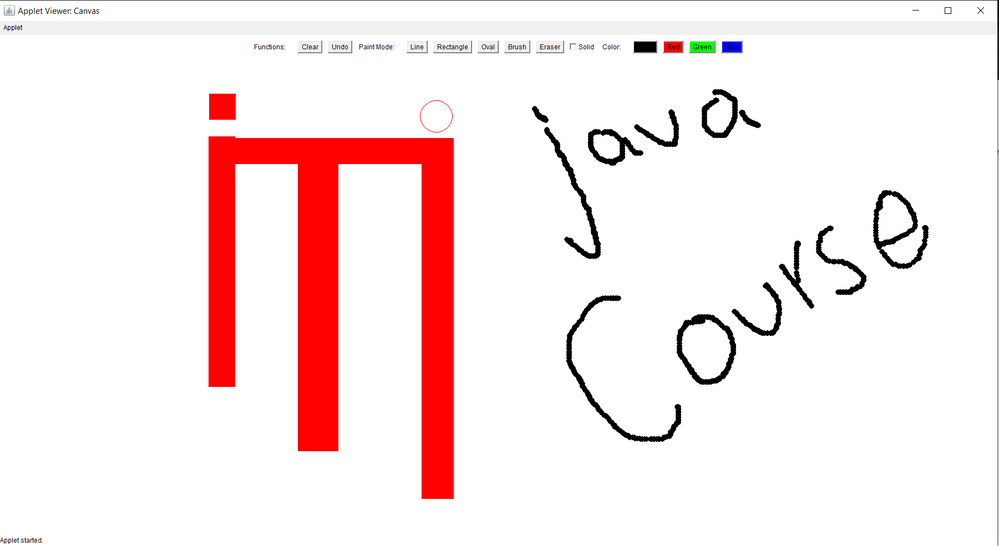

# Paint Brush Project - README

## Overview

The **Paint Brush** project is an Applet-based application that allows users to draw basic shapes, doodle freely, and manage their drawings with various tools. The application supports different colors, shapes, and line strokes, along with features like erasing, clearing the canvas, and undo functionality. The project is designed to demonstrate a strong understanding of Object-Oriented Programming (OOP) principles.

## Features

### 1. **Color Buttons**
   - Users can select a color before drawing.
   - Available colors:
     - Red
     - Green
     - Blue

### 2. **Shape Buttons**
   - Users can draw shapes by dragging from a start point to an end point.
   - Available shapes:
     - Rectangle
     - Oval
     - Line

### 3. **Free Hand Button**
   - Allows users to doodle freely by dragging the mouse.

### 4. **Eraser Button**
   - Enables users to erase parts of their drawings.

### 5. **Clear All Button**
   - Clears the entire drawing area.

### 6. **Filled Checkbox**
   - When checked, shapes (Rectangle or Oval) will be filled with the selected color.
   - When unchecked, shapes will be drawn as outlines only.

### 7. **Bonus Features**
   - **Undo Button**: Allows users to undo their previous actions.
   - **Dotted Checkbox**: When checked, shapes will be drawn with dotted line strokes. When unchecked, shapes will have solid line strokes.

## How to Use

1. **Select a Color**: Click on one of the color buttons (Red, Green, Blue) to choose the drawing color.
2. **Select a Shape**: Click on one of the shape buttons (Rectangle, Oval, Line) to draw the corresponding shape.
3. **Free Hand Drawing**: Click the Free Hand button to doodle freely.
4. **Erase**: Click the Eraser button to erase parts of the drawing.
5. **Clear All**: Click the Clear All button to remove all drawings from the canvas.
6. **Filled Shapes**: Check the Filled checkbox to draw filled shapes (Rectangle or Oval).
7. **Undo**: Use the Undo button to revert the last action.
8. **Dotted Lines**: Check the Dotted checkbox to draw shapes with dotted lines.

## Project Structure

The project is designed with OOP principles in mind. The main components include:

- **Color Buttons**: Handles color selection.
- **Shape Buttons**: Manages shape drawing.
- **Free Hand Tool**: Allows freehand drawing.
- **Eraser Tool**: Implements erasing functionality.
- **Clear All**: Clears the canvas.
- **Filled Checkbox**: Controls whether shapes are filled or outlined.
- **Undo Button**: Manages undo operations.
- **Dotted Checkbox**: Controls line stroke style (dotted or solid).

## Requirements

- Java Development Kit (JDK)
- An IDE or text editor for Java (e.g., IntelliJ IDEA, Eclipse, or VS Code)
- Applet support (if running in a browser)

## Running the Project

1. Clone or download the project repository.
2. Open the project in your preferred Java IDE.
3. Compile and run the `Canvas.java` file.
4. Use the buttons and checkboxes to interact with the drawing canvas.

Enjoy drawing with the **Paint Brush** application! 🎨
